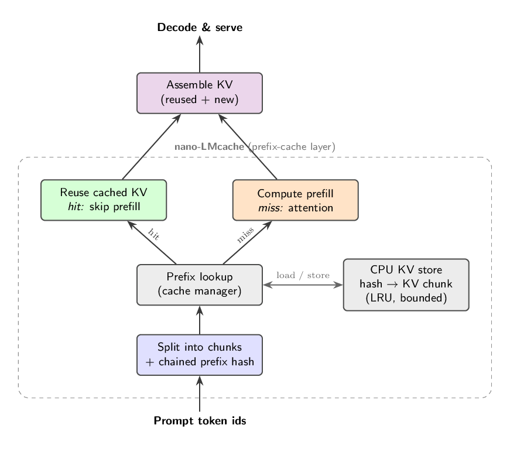

# nano-LMcache

 

A lightweight prefix cache (KV-cache reuse) for LLM serving, built from scratch —
the nano version of what [LMCache](https://github.com/LMCache/LMCache) does: reuse
the KV of shared prompt prefixes so you skip recomputing prefill.

> Reference: [vLLM + LMCache: A Starter Guide, No GPU Required](https://blog.lmcache.ai/en/2026/06/23/vllm-lmcache-a-starter-guide-no-gpu-required/)

## Key Features

- **Readable**: the whole idea in ~200 lines — chunk hashing, an LRU CPU KV store, prefix lookup/insert.
- **Real mechanics**: a CPU simulation with real tensors, mapping 1:1 to LMCache's design.
- **No GPU required**: runs on a laptop; `pip install torch` is the only dependency.

## Architecture

<p align="center"></p>

Green = cache hit (reuse KV, cheap) · red = miss (recompute) · blue = the KV store. A
request sharing a system prompt / RAG context / chat history with an earlier one reuses
that prefix's KV for free — only the divergent suffix is recomputed.

## Installation

```bash
git clone https://github.com/2imi9/nano-LMcache && cd nano-LMcache
pip install torch
```

## Quick Start

```python
from nanolmcache import PrefixCache

cache = PrefixCache(chunk_size=16, namespace="my-model")   # one cache per model
hit, chunks = cache.lookup(prompt_token_ids)               # leading tokens already cached
cache.insert(prompt_token_ids, kv_tensor)                  # store [L, 2, T, kv_heads, head_dim]
```

## Benchmark

Simulated shared-prefix traffic — 20 requests, a 512-token shared system prompt, 128-token unique suffix:

| Cache | Prefill tokens | Saved |
|---|---:|---:|
| off | 12,800 | — |
| nano-LMcache | 3,072 | **76%** |

```bash
python3 bench/simulate.py qwen3-8b 20   # reproduce
python3 tests/test_cache.py             # 8 tests, no pytest needed
```

## How it maps to LMCache

| this repo | LMCache |
|---|---|
| chained chunk hash | blake3 over 256-token chunks |
| `KVStore` (CPU, LRU) | L1 CPU backend (+ disk / Redis / remote) |
| `PrefixCache.lookup/insert` | the cache engine's store/retrieve |
| `vllm_connector/` | `LMCacheConnectorV1` (same vLLM v1 KV-connector API) |

## Roadmap

- [x] Core (hashing, store, prefix lookup/insert) + CPU simulation
- [ ] Real prefix-cache hit through the vLLM v1 connector
- [ ] Native GPU KV-transfer path; model-specific (FP8 / sparse-attention) reuse

---

Not a replacement for LMCache — a clean-room teaching implementation of the same idea. MIT.
